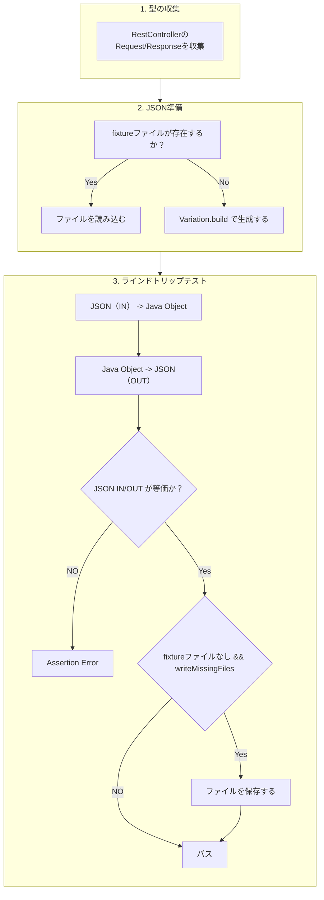

# spring-payload-binding-test

Spring Bootのエンドポイントに使用される JSON バインディングを検証すテストツールです。

`0.0.1` はSpringBoot3.5.xを対象にしています。
SpringBoot4.0.x対応は対応と公開方法を検討中。

## 仕組み



## Getting Started

1. 依存を追加する
2. テストクラスを作成する

### 依存を追加する

`com.github.irof:spring-payload-binding-test` をテストスコープで依存に追加します。

Gradle (`build.gradle.kts`):

```kotlin
dependencies {
    testImplementation("com.github.irof:spring-payload-binding-test:0.0.1")
}
```

Maven (`pom.xml`):

```xml
<dependencies>
    <dependency>
        <groupId>com.github.irof</groupId>
        <artifactId>spring-payload-binding-test</artifactId>
        <version>0.0.1</version>
        <scope>test</scope>
    </dependency>
</dependencies>
```

### テストクラスを作成する

`JsonBindingContractTestBase` を継承した空のサブクラスを記述します。

```java
@SpringBootTest
class JsonBindingContractTest extends JsonBindingContractTestBase {
}
```

これで `@RestController` の入出力の型が自動収集され、それぞれに対して JSON バインディングの検証が行われる。

## 検証内容

各ペイロード型に対して deserialize → serialize → 元 JSON と等価性比較というラウンドトリップ検査を行う。
リクエスト/レスポンスの区別はせず、エンドポイントから収集された型集合に対して一律に検査する。
同じ型が複数エンドポイントで使われる場合は1回だけ検査する。

### 対象外
以下は自動的に除外されます。

- フレームワーク提供のハンドラ (`BasicErrorController` 等) 
- `Resource` / `MultipartFile` 等のフレームワーク型 (`org.springframework.*` / `jakarta.*` / `javax.*`) 

## 設定など

### バリエーション

テストに使用されるデータのパターンをバリエーションと呼んでいます。
各ペイロード型に対して複数のバリエーションのテストを行うようになっています。

テスト対象のバリエーションは `variations` メソッドをオーバーライドすることで変更できます。
デフォルトではビルドインバリエーションが設定されています。

#### ビルトインバリエーション

| バリエーション | 生成される JSON | 目的 |
|---|---|---|
| `Variation.SAMPLE` | 全フィールドにサンプル値（"sample", `1`, enum 第一定数 等） | 通常経路のバインディング検査 |
| `Variation.NULL` | 全フィールド `null` の object (`@JsonValue` 型は top-level `null`) | null 受容性の検査 |
| `Variation.EMPTY` | 空/ゼロ値 (String→`""`, コレクション→`[]`, primitive→デフォルト値, ネスト object は再帰的に empty) | 空値・初期値の受容性検査 |

##### SAMPLEで生成される値

`SampleJsonFactory` が `JavaType` から再帰的に `JsonNode` を構築する。

- スカラー:
    - `String→"sample"`
    - 数値→`1`
    - `enum`→第一定数
    - `LocalDate→"2024-01-01"`
    - `UUID`/`Instant`/`URI` 等
- コレクション・配列: 要素 1 個
- Map: 1 エントリ (キー型に応じた値、例えば `Map<Priority,Long>` → `{"LOW": 1}`)
- Bean / record: `BeanDescription` の serializationConfig 由来 property を全て埋める
- 循環参照: `path` Set で検出して `NullNode`

#### カスタムバリエーション

`Variation` インタフェースを実装すれば任意のバリエーション (境界値、最小値のみ、特定エラーケース等) を追加できる:

```java
class MinimumValuesVariation implements Variation {
    public String name() { return "minimum"; }
    public JsonNode build(JavaType type, ObjectMapper mapper) {
        // ... カスタムロジック
    }
}
```

#### 応用: 型ごとのバリエーション指定

`variations(PayloadType)` を override し、各ペイロードに対して実行するバリエーション群を返す。型ごとに自由に組み替え可能 (NULL を受け付けない型はリストから外す、特定型だけカスタムバリエーションを追加する、等)。

```java
@SpringBootTest
class JsonBindingContractTest extends JsonBindingContractTestBase {
    @Override
    protected List<Variation> variations(PayloadType payload) {
        Class<?> raw = payload.type().getRawClass();
        // primitive を含む型は NULL variation で round-trip 不可なので除外
        if (raw == SearchResult.class || raw == TodoStats.class) {
            return List.of(Variation.SAMPLE);
        }
        // 特定の型だけカスタムバリエーションを足すこともできる
        if (raw == TodoList.class) {
            return List.of(Variation.SAMPLE, Variation.NULL, new MinimumValuesVariation());
        }
        return super.variations(payload);
    }
}
```

### fixture JSON

変換するJSON（fixture JSON）は固定と動的生成に対応しており、各型とバリエーションの組み合わせで `src/test/resources/json-binding/{FQN}/{variation}.json` の有無で動作が自動切替されます。

- **ファイルあり**: そのファイルの JSON を source として読み込みラウンドトリップ検査
- **ファイルなし**: `Variation.build()` でその場生成してラウンドトリップ検査

ファイルがなくても「とりあえずJSONと変換できる」は確認できます。簡易確認用です。

ファイルを用意しておくことで「想定するJSONと変換できる」が確認できます。こちらが本命の使い方です。ライブラリの設定変更などの影響を見れます。

fixture を新規作成・更新したい時は `writeMissingFiles` メソッドのオーバーライドか、 `-Djson.binding.write=true` で実行すると、ファイルが無くて build したケースのみ JSON が該当パスに書き出されれます。
ファイルがある場合はbuildされないので上書きはされません。

fixture を再生成したい場合はファイルを削除してから write 実行してください。

```
# 不足分の fixture を生成
./gradlew test -Djson.binding.write=true

# 全 fixture を再生成
rm -r src/test/resources/json-binding && ./gradlew test -Djson.binding.write=true
```

## その他

### 実行時ログ

各テストで使用された JSON が INFO ログに pretty-print 出力される (build か file かの出自も併記)。

```
[sample] com.example.demo.todo.TodoList (built)
{
  "id" : "sample",
  "title" : "sample",
  ...
}
```

SLF4Jを使用したログを

### 検査対象の絞り込み

- ルート (= `@RequestBody` 引数 / 戻り値) のみを検査対象とし、Bean プロパティを通じた推移的な型は個別検査しない。
- ルートのサンプル生成時点で内部型は値が埋まりラウンドトリップされるため、別途検査の必要はない。
- `Collection<T>` / `Optional<T>` / `ResponseEntity<T>` 等のコンテナはアンラップして `T` を検査対象とする。
- `java.*` のスカラー / プリミティブ / enum は検査しない。

### 利用例

`todo-app` がテストを兼ねた利用例になっています。
